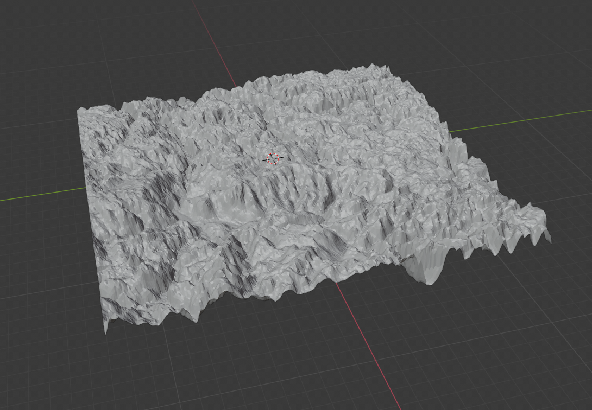
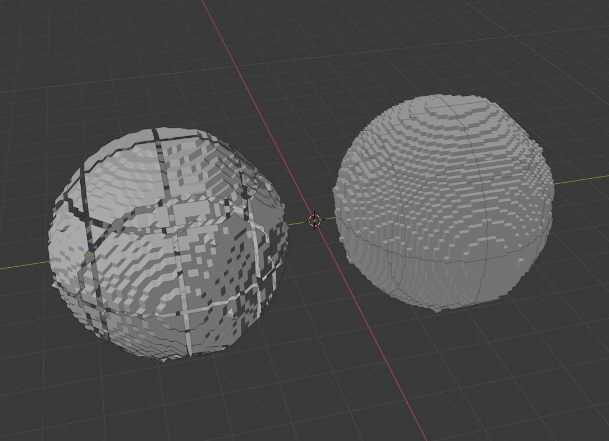
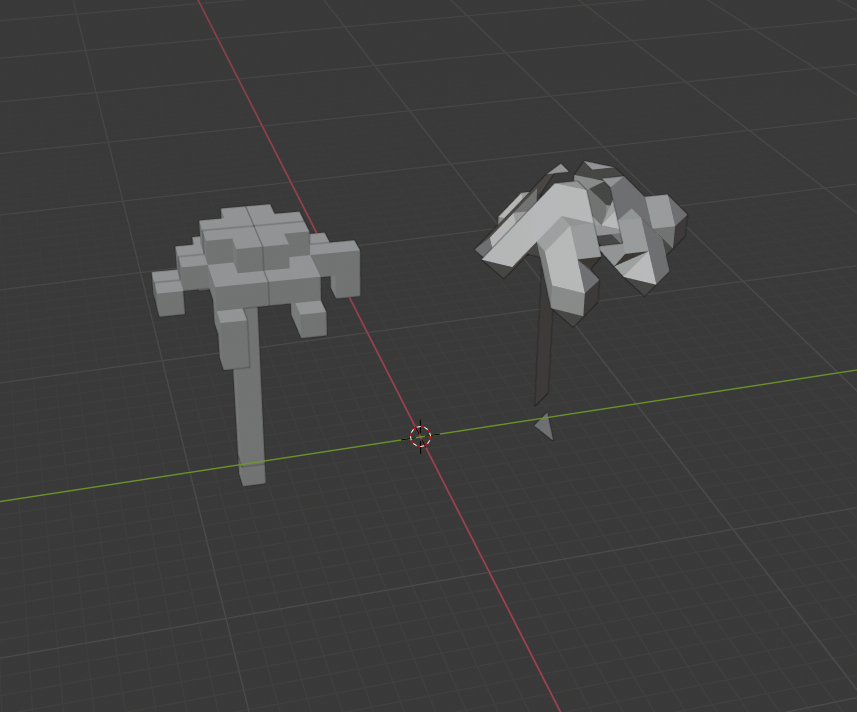

# Gaiku (WIP very early development stage)


[3d](gaiku-3d) agnostic framework (game engine) terrain engine. The purpose of the Gaiku is to provide a 

foundation to build your games easily without worrying about implementing your own terrain engine.

The main crate is developed game engine agnostic, so we can help to reach more developers.

## Supported game engines

- [Amethyst](gaiku-amethyst)

## Features

General features:

- Mesh generation
  - Height map
  - Marching Cubes
  - Voxel
- Mesh collider
- Texturing
- Foliage support
- Chunk based for infinite generated terrains
- Mesh optimization
- LOD support
- For procedural terrain generation check the 3d `Baker` documentation.

## Examples

### 3d

To run the examples go to the folder `gaiku-3d` and run with:

```bash
cargo run --example heightmap
cargo run --example marching_cubes
cargo run --example voxel
```

Then go to the `gaiku-3d/output` folder and see the exported `.obj` files.

**Heightmap**



**Voxel and Marching cubes**

Planet



Terrain


Tree




* *There are some kown and unresolved issues with the marching cubes baker.*

## License

Licensed under either of

- Apache License, Version 2.0, ([license/APACHE](license/APACHE) or http://www.apache.org/licenses/LICENSE-2.0)
- MIT license ([license/MIT](license/MIT) or http://opensource.org/licenses/MIT)

at your option.
